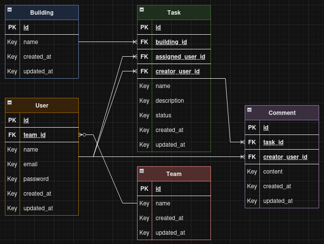

# Proprli App 🏠

Backend PHP-8/Laravel project for Proprli.

## Used tools 🛠️

- PHP v8.1.0
- Composer v2.8.3
- Laravel v10.10

## How to start (development build using Laravel Sail)

To start properly you must have PHP v8.1.0 and Composer v2.8.3 installed on your environment. I used the ASDF runtime manager to deal with multiple programming languagens and it's versions.

```bash
cp .env.example .env # Creates a new environment variables file

composer install # Installs the dependencies

php artisan key:generate # Generates a new APP_KEY value and stores it in .env

./vendor/bin/sail up # Creates and starts both laravel and psql containers using Sail

./vendor/bin/sail artisan migrate:fresh --seed # Executes database migrations and triggers the seeders
```

## Running unit and feature tests

```bash
./vendor/bin/pint artisan test
```

## Format project files

The following cli command will format all project PHP files (using Laravel Pint)

```bash
./vendor/bin/pint # Formats all project files using PSR-12 standards
```

## Project development and decisions explanation

### ERD

Using the technical assessment email description and based on the context of the application I've considered to develop 5 entities:

- Buildings: Represents a building (in the real estate sector context), which can have multiple Tasks attached to it;
- Teams: Represents the teams, which can have multiple Users attached to it;
- Users: Represents the users (like the "owners" mentioned in this assessment email), they can have and make multiple Tasks and Comments;
- Tasks: Represents a demand attached to an User, which can have multiple Comments;
- Comments: Represents the comments made by Users.



### Some notes that I've considered during the development

- An user can only assign a task to a team member, users from other teams aren't allowed from been attached;
- Only users from the same team can comment in tasks of each other;
- The tasks are attached to the building, this will allow users/teams to manage multiple buildings;
- Because of the above note I've decided that users will belong to only one team. This will be enough (for while I think) because they can already handle multiple buildings;
- I've used "one to many" relationships in almost all entities relations, except on Teams x Users, I think an user could exist without being on a team (like an admin, support or back-office user).

### About the architecture

I chose to use the Clean-Architecture approach in this Laravel application, which consists of a separation of responsibilities such as:

- Keep for Laravel only the responsibility of handling the API configuration and database manipulation;
- Keep all flows of business rules (represented by UseCases classes) and their actors (represented by Entities classes) out of the Laravel context. This allowed me to do more accurate unit testing without dealing with routes, controllers, network protocols and other technology settings that "don’t matter" for business testing.

In my opinion using a Clean or Hexagonal architectures makes easier to make both unit and feature test and brings to us the posibility the deal with dependencies and version upgrades of frameworks without headache. Imagine if we'll decide to migrate this application to a new PHP/Laravel version or to a Symfony Framework for example, the entire piece of software that deals with business it's already implemented without depending from any external resources. Obviously, not all the projects need that, sometimes just a well implemented dependency inversion pattern is enough, but for the purposes of this technical assessment I've decided to show some of my skills and what I've been studying.

### About the REST API

I've exported an Insomnia request collection containing all the developed endpoints, if you want to make the request from Insomnia/Postman, please import it.

Building registering and it's payload:

Route: POST `/api/buildings/{building_id}/tasks`

```json
{
 "name": "any_name",
 "description": "any_description",
 "status": "OPEN",
 "assigned_user_id": 1,
 "creator_user_id": 2
}
```

Comment registering and it's payload:

Route: POST `/api/tasks/{task_id}/comments`

```json
{
 "content": "any_content",
 "creator_user_id": 5
}
```

Task fetching with all available query params:

Route: GET `/api/tasks?status=REJECTED&assigned_user_id=4&start_date=2024-11-01&end_date=2024-12-20&building_id=1`

- status: Filters based on their status value, such OPEN, IN_PROGRESS, COMPLETED or REJECTED;
- assigned_user_id: Filters based on their assigned user id;
- building_id: Filters based on their building id;
- start_date: Filters based on their date of creation (if is on or after the provided value);
- end_date: Filters based on their date of creation (if is on or before the provided value).

----------
Released in 2024 by [Victor B. Fiamoncini](https://github.com/Victor-Fiamoncini) ☕
